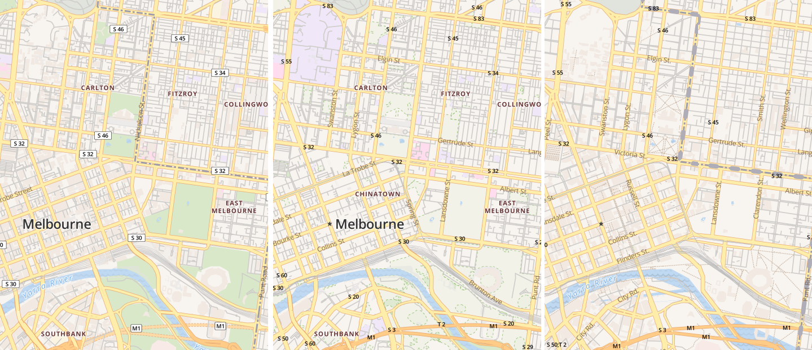

## Moved

This project is now at https://gitlab.com/stevage/mapbox2tangram, with many more updates.

## Old readme

This tool helps you port style files for Mapbox-GL-JS between three major OpenStreetMap vector tile providers: Mapbox, MapZen and OpenMapTiles. It's at an early proof-of-concept stage.

For instance, here's OpenMapTiles.org's "OsmBright" style (on the left), as converted for Mapbox (centre), and Mapzen (right).

Remember that not all style files are open sourced. Please do not use this tool to rip off Mapbox's proprietary styles – or anyone else's for that matter..

### How to use

1. Put a style file in `in/mystyle.json`
2. Modify `index.js` to point to it :)
3. Run `index.js`
4. Output goes into `out/mystyle-mapbox.json` and `out/mystyle-mapzen.json`
5. Serve up the directory, say `python -m SimpleHTTPServer 8000`
6. Go to `localhost:8000/#mystyle`
